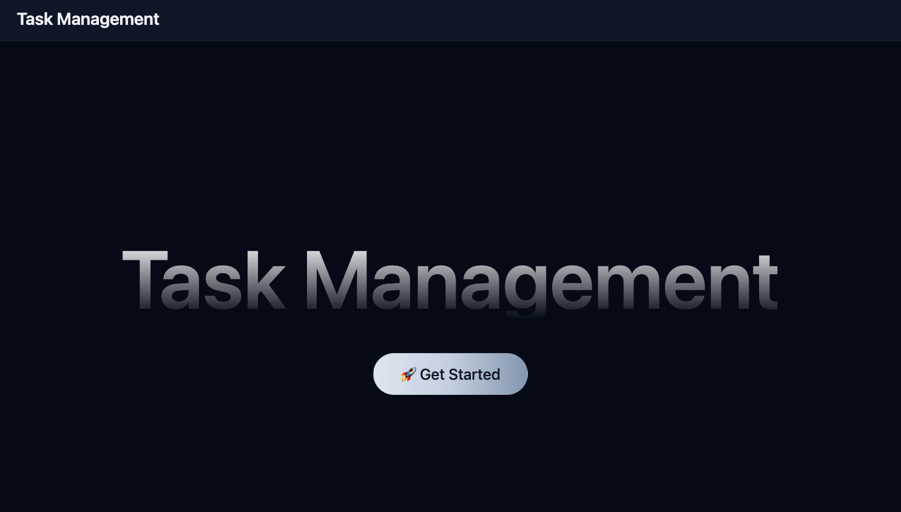
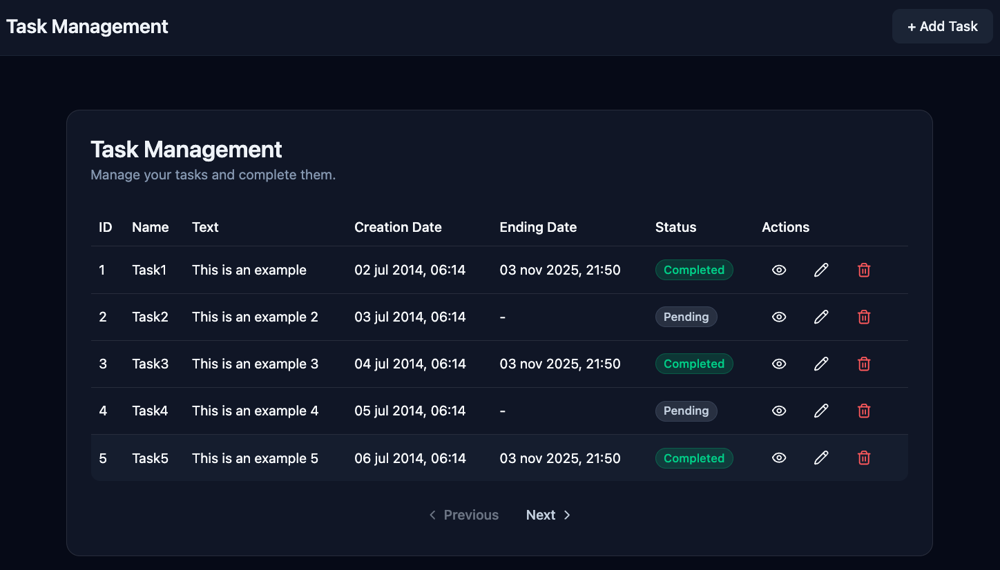

# 🧠 Task Manager – Technical Test

Full-stack application developed as a **technical assessment**.  
The app allows users to **create, list, delete and mark tasks as completed**, using a simple and modern interface.

---
## Screenshots



---

## ⚙️ Stack

### 🖥️ Backend
- Spring Boot 3.5  
- Java 11
- Maven  
- H2 Database (in-memory)  
- Spring Data JPA  
- REST API  

### 💻 Frontend
- React 19 (Vite)
- Tailwind CSS
- Shadcn/UI components
- Axios
- React Router DOM

---

## 🚀 Run the Project

### 1️⃣ Backend

**Start the API**

```bash
cd backend

mvn clean install

mvn spring-boot:run

```
H2 Console

```bash
URL: http://localhost:8080/h2-console

JDBC URL: jdbc:h2:mem:testdb

Username: imatia

Password: imatia1234
```

The backend runs on: http://localhost:8080

### 1️⃣ Frontend

```bash
cd frontend

npm install

npm run dev
```

**Frontend .env:**
```env
API_URL=http://localhost:8080/api/tasks
```

## API Endpoints

| Method | Route | Description |
|--------|------|-------------|
| GET | `/api/tasks` | List tasks |
| GET | `/api/tasks/{id}` | View task |
| DELETE | `/api/tasks/{id}` | Delete task |
| POST | `/api/tasks` | Create a new task |
| PATCH | `/api/tasks/{id}/complete` | Mark task as completed |

## 📘 Documentation
For detailed technical documentation, see [`/doc/documentation.md`](./doc/documentation.md) or download the [PDF version](./doc/documentation.pdf).

## 🌐 Production URL
```env
PROD_URL=https://task-manager-lake-tau-77.vercel.app
```