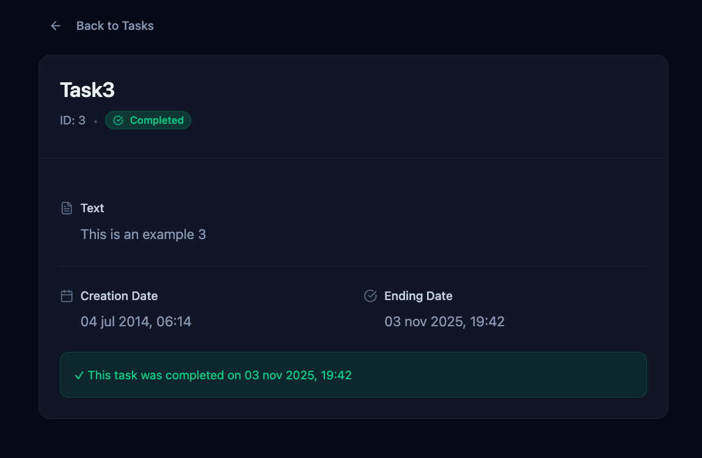
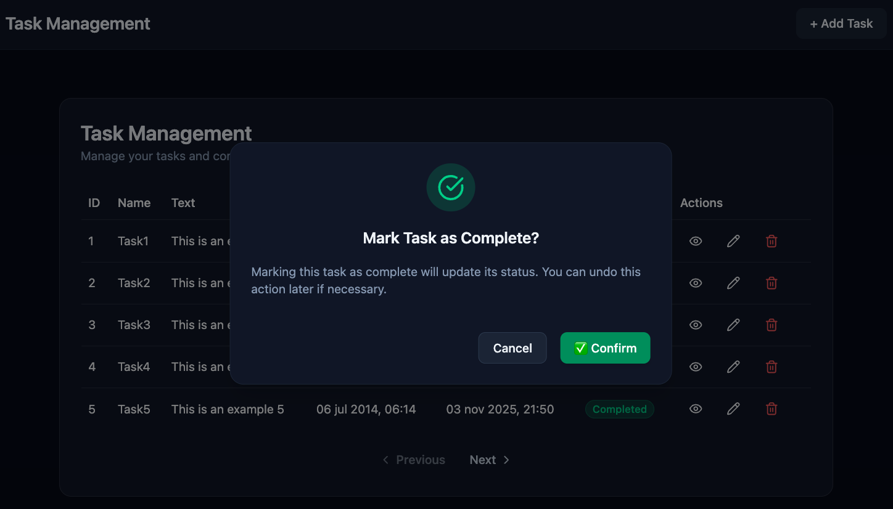
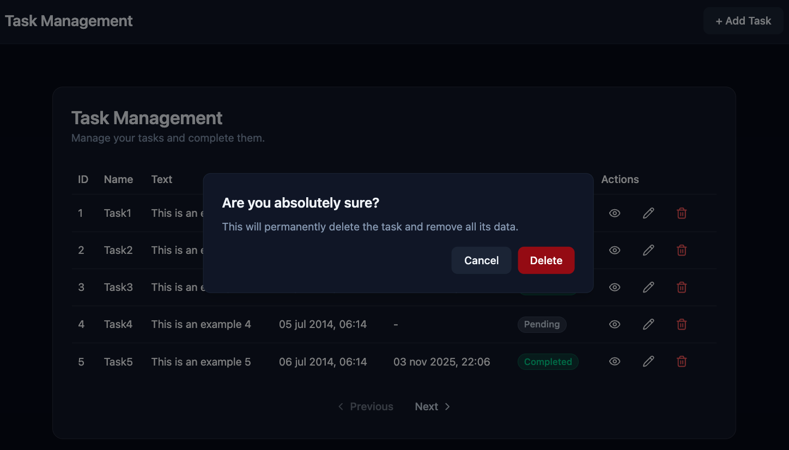
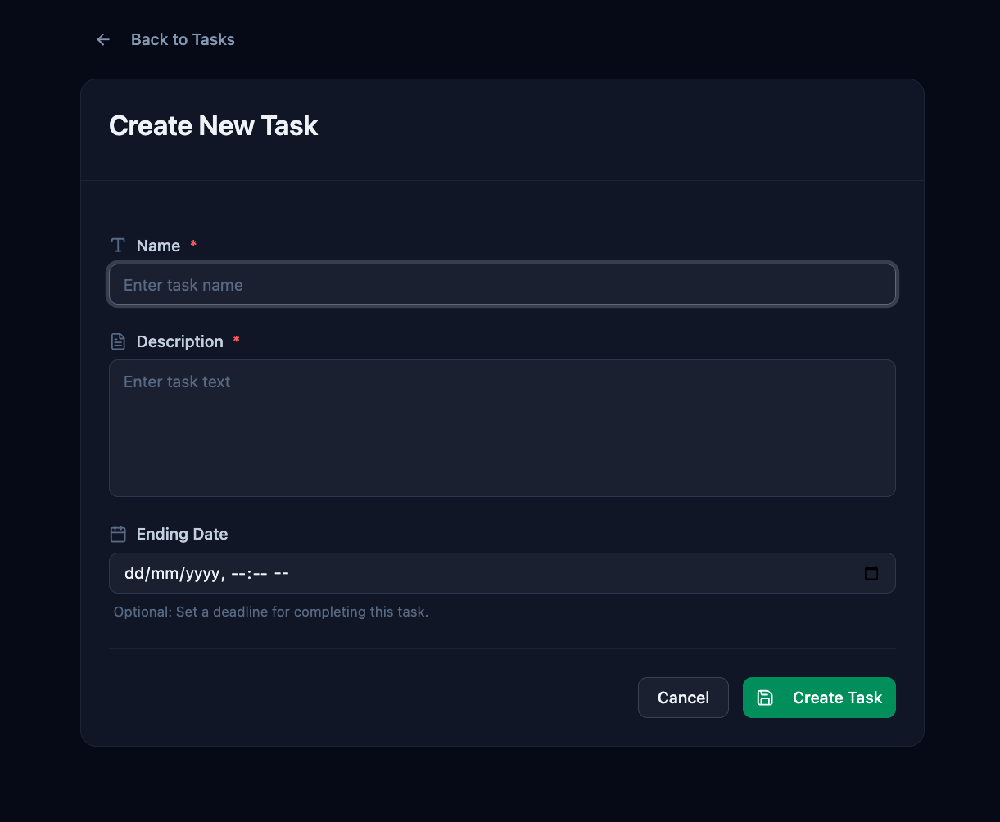

# 🧠 Task Manager – Technical Documentation

---

## 1️⃣ Overview

This project is a **full-stack web application** developed as part of a technical assessment.  
It allows users to **create**, **list**, **delete**, and **mark tasks as completed**, with a clean, responsive, and modern interface.

The focus was on:
- Building a functional and consistent API using **Spring Boot**
- Designing a minimalist and pleasant **React** frontend using **Shadcn/UI + Tailwind**
- Ensuring **clean architecture**, **scalability**, and **code readability**

---

## 📸 Screenshots

### Home Page

_View with gradient title and “Get Started” button._

### Task List

_Displays all tasks with pagination and completion badges._

### Task Detail

_View individual task information._

### Mark Task as Complete

_Confirmation dialog for marking a task as completed._

### Delete Task

_Confirmation dialog for deleting a task._

### Task Create Form

_Form with validation and optional ending date input._

---

## 2️⃣ Objectives

- ✅ Develop a simple task management system (CRUD simplified)
- ✅ Store and manage data in an in-memory database (H2)
- ✅ Allow toggling completion status for tasks
- ✅ Implement responsive design and form validation
- ✅ Follow clean code and best practices

---

## 3️⃣ Technologies Used

### 🖥️ Backend
- **Language:** Java 11  
- **Framework:** Spring Boot 3.5  
- **Build Tool:** Maven  
- **Database:** H2 (in-memory)  
- **Testing:** JUnit 5, AssertJ  
- **Tools:** Yaak (API testing)

### 💻 Frontend
- **Language:** JavaScript (ES6)  
- **Framework:** React 19 (Vite)  
- **UI Library:** Shadcn/UI  
- **CSS Framework:** TailwindCSS  
- **Routing:** React Router DOM  
- **HTTP Client:** Axios  
- **Icons:** Lucide React  

---

## 4️⃣ Installation & Setup

### Prerequisites
- Java 11 or higher
- Node.js 18+ and npm
- Maven 3.6+

### Backend Setup
```bash
cd backend
mvn clean install
mvn spring-boot:run
```
The API will be available at `http://localhost:8080`

### Frontend Setup
```bash
cd frontend
npm install
npm run dev
```
The application will be available at `http://localhost:3000`

### Database
H2 console available at: `http://localhost:8080/h2-console`
- JDBC URL: `jdbc:h2:mem:testdb`
- Username: `imatia`
- Password: `imatia1234`

---

## 5️⃣ Application Requirements

| Requirement | Description |
|--------------|-------------|
| **Create Task** | The user can create a task with name, description, and optional ending date. |
| **List Tasks** | The system displays all existing tasks with pagination. |
| **Delete Task** | Tasks can be deleted by the user. |
| **Mark as Completed** | Tasks can be marked as completed, automatically assigning an ending date. |
| **Data Validation** | The backend validates name and text fields (non-null, length). |
| **Error Handling** | Proper exceptions are returned for invalid or missing data. |
| **CORS** | Frontend and backend communication enabled for localhost (React + API). |

---

## 6️⃣ Architecture Overview

### Backend Layers
- **Controller:** Handles HTTP requests (`TaskController.java`)
- **Service:** Business logic (`TaskService.java`)
- **DAO (Data Access Object):** Persistence layer with direct database operations (`TaskDao.java`)
- **Entity:** Data model mapped to database (`Task.java`)
- **DTO + Converter:** Transfer objects for clean layer separation

### Frontend Components

| Component | Description |
|------------|-------------|
| **Home.jsx** | Landing page with gradient title and “Get Started” button |
| **Navbar.jsx** | Navigation bar with app branding and button to add a new task |
| **TaskList.jsx** | Displays paginated list of tasks, including completion badge |
| **TaskCreate.jsx** | Form to create a new task (with required validation) |
| **TaskDetail.jsx** | Shows detailed view of a single task with all properties |
| **TaskService.js** | Axios API requests to backend endpoints |

---

## 7️⃣  API Endpoints

La API REST expone los siguientes endpoints:

| Method | Route | Description |
|:--|:--|:--|
| **GET** | `/api/tasks` | Retrieve all tasks |
| **GET** | `/api/tasks/{id}` | Retrieve a task by ID |
| **DELETE** | `/api/tasks/{id}` | Delete a task by ID |
| **POST** | `/api/tasks` | Create a new task |
| **PATCH** | `/api/tasks/{id}/complete` | Update completion status |

📦 **Example JSON (POST /api/tasks)**

```json
{
  "name": "Finish report",
  "text": "Write technical documentation",
  "endingDate": "2025-11-04T18:00:00"
}

```
📦 **Example JSON (PATCH /api/tasks/id/complete)**

```json
{
  "id": 1,
  "name": "Task1",
  "text": "This is an example",
  "creationDate": "2014-07-02T06:14:00.742",
  "endingDate": "2025-11-03T19:54:10.432083",
  "completed": true
}
```

📦 **Example JSON (GET /api/tasks)**

```json
[
  {
    "id": 1,
    "name": "Task1",
    "text": "This is an example",
    "creationDate": "2014-07-02T06:14:00.742",
    "endingDate": null,
    "completed": false
  },
  {
    "id": 2,
    "name": "Task2",
    "text": "This is an example 2",
    "creationDate": "2014-07-03T06:14:00.742",
    "endingDate": null,
    "completed": false
  },
]
```

📦 **Example JSON (GET /api/tasks/3)**

```json
{
  "id": 3,
  "name": "Task3",
  "text": "This is an example 3",
  "creationDate": "2014-07-04T06:14:00.742",
  "endingDate": null,
  "completed": false
}
```

## 8️⃣ CORS Configuration

CORS is configured via `CorsFilter` in the `SecurityConfig` class to allow access from the frontend (React/Vite):
```java
    @Bean
    public CorsFilter corsFilter() {
        CorsConfiguration config = new CorsConfiguration();
        config.setAllowCredentials(false);
        config.setAllowedOrigins(List.of(
                "http://localhost:3000", "http://localhost:5173"
        ));
        config.setAllowedMethods(List.of("GET","POST","PUT","PATCH","DELETE","OPTIONS"));
        config.setAllowedHeaders(List.of("*"));
        UrlBasedCorsConfigurationSource source = new UrlBasedCorsConfigurationSource();
        source.registerCorsConfiguration("/**", config);
        return new CorsFilter(source);
    }
}
```

**Configuration details:**
- **Allowed Origins**: `localhost:3000` (Create React App) and `localhost:5173` (Vite)
- **Allowed Methods**: All CRUD operations plus OPTIONS for preflight requests
- **Allowed Headers**: All headers (`*`)
- **Credentials**: Disabled (`false`) as no authentication is implemented

This configuration enables seamless communication between the React frontend and Spring Boot backend during development.

---

# 9️⃣ Code Quality and Best Practices

The project follows clean code principles and modern development standards:

- **Single Responsibility**: Each class handles only one concern.
- **DTO usage**: Decouples entity and API response models.
- **Error Handling**: Custom exceptions (`ResourceNotFoundException`, `InvalidDateRangeException`).
- **Validation**: Required fields and logical checks (ending date after creation date).
- **Consistent naming**: LowerCamelCase for variables and methods.
- **Separation of concerns**: Controller → Service → DAO → Database.

**Frontend**:
- Reusable components (Buttons, Cards, Table, Dialog)
- Consistent color palette (`slate` shades)
- Responsive layout with Tailwind utility classes

---

## 🔟 Testing

### 🧪 Unit Tests (JUnit)

The project includes comprehensive unit tests that verify service logic, validation rules, and business operations using **Spring Boot Test** with an in-memory database.

**Test configuration:**
```java
@SpringBootTest
@ActiveProfiles("test")
@Transactional
class TaskmanagerACApplicationTests {
    @Autowired
    private TaskService taskService;
}
```

**Test coverage includes:**

- ✅ **Task creation** - Validates correct task persistence
```java
@Test
void createTaskTest() {
    Task newTask = new Task(1L, "Task 1", "Description example",
            Timestamp.valueOf(LocalDateTime.of(2025,2,3,10,0)),
            null, false);
    TaskDto taskDto = taskService.createTask(newTask);
    assertThat(taskDto.getName()).isEqualTo("Task 1");
}
```

- ✅ **Input validation** - Ensures null name and text are rejected
- ✅ **Date validation** - Prevents invalid date ranges (ending date before creation date)
- ✅ **Task retrieval** - Tests finding tasks by ID and listing all tasks
- ✅ **Completion toggle** - Verifies marking tasks as completed/incomplete
  - Sets `completed = true` and assigns `endingDate`
  - Sets `completed = false` and clears `endingDate`
- ✅ **Exception handling** - Confirms `ResourceNotFoundException` and `InvalidDateRangeException` are thrown appropriately

**Key testing features:**
- Uses `@Transactional` to rollback changes after each test
- Leverages AssertJ for fluent assertions
- Covers both happy paths and error scenarios

### 🔄 Integration Tests

End-to-end workflow validation testing the complete application flow:

1. **Create a new task** via `POST /api/tasks`
   - Verify task is persisted with correct data
   - Confirm `completed = false` and `endingDate = null`

2. **List all tasks** via `GET /api/tasks`
   - Verify the newly created task appears in the list
   - Confirm all task fields are correctly serialized

3. **Get task details** via `GET /api/tasks/{id}`
   - Retrieve specific task by ID
   - Validate all properties match the created task

4. **Mark task as completed** via `PATCH /api/tasks/{id}/complete`
   - Verify `completed` changes to `true`
   - Confirm `endingDate` is automatically assigned with current timestamp

5. **Mark task as pending** via `PATCH /api/tasks/{id}/complete`
   - Verify `completed` changes back to `false`
   - Confirm `endingDate` is cleared (set to `null`)

6. **Delete task** via `DELETE /api/tasks/{id}`
   - Verify correct deletion
   - Confirm the rest of task are correctly serialized


### 🧭 Frontend Testing

- Manual testing with Yaak and browser interactions
- Validation of form inputs (`required` fields)
- UI confirmation dialogs before updating task status
- Tested with React DevTools and browser console

---

## Scalability and Performance

- **Stateless REST API**: Easily scalable horizontally.
- **Database abstraction**: Switching from H2 to MySQL/PostgreSQL requires minimal configuration.
- **Frontend pagination**: Implemented on the client side for intuitive data navigation
- **Optimized frontend**: Built with Vite for fast builds and hot reload.
- **Lightweight dependencies**: Ensures fast startup and minimal memory footprint.

---

# 1️⃣1️⃣ UX & UI Design

- **Framework**: Shadcn/UI with TailwindCSS styling.
- **Theme**: Dark mode with "slate" color palette.
- **Typography**: Clean and readable sans-serif.

**User experience**:
- Required field indicators (`*`)
- Responsive layout
- Confirmation dialogs with icons (Shadcn AlertDialog)
- Task status badges (`Completed` / `Pending`)
- Hover and focus states on all interactive elements
- Text overflow handling in tables and cards (truncation with ellipsis and proper wrapping) to keep content readable and layouts clean.

---

# 1️⃣2️⃣ Conclusion

This project demonstrates:

- A complete React + Spring Boot full-stack implementation
- Clean, modular and maintainable architecture
- Adherence to SOLID and REST principles
- Consistent UI/UX design and smooth usability
- Proper testing, scalability, and CORS setup

The result is a simple, elegant, and extendable web application aligned with industry best practices.

---

# 👨‍💻 Author

**Pablo Rodríguez** 